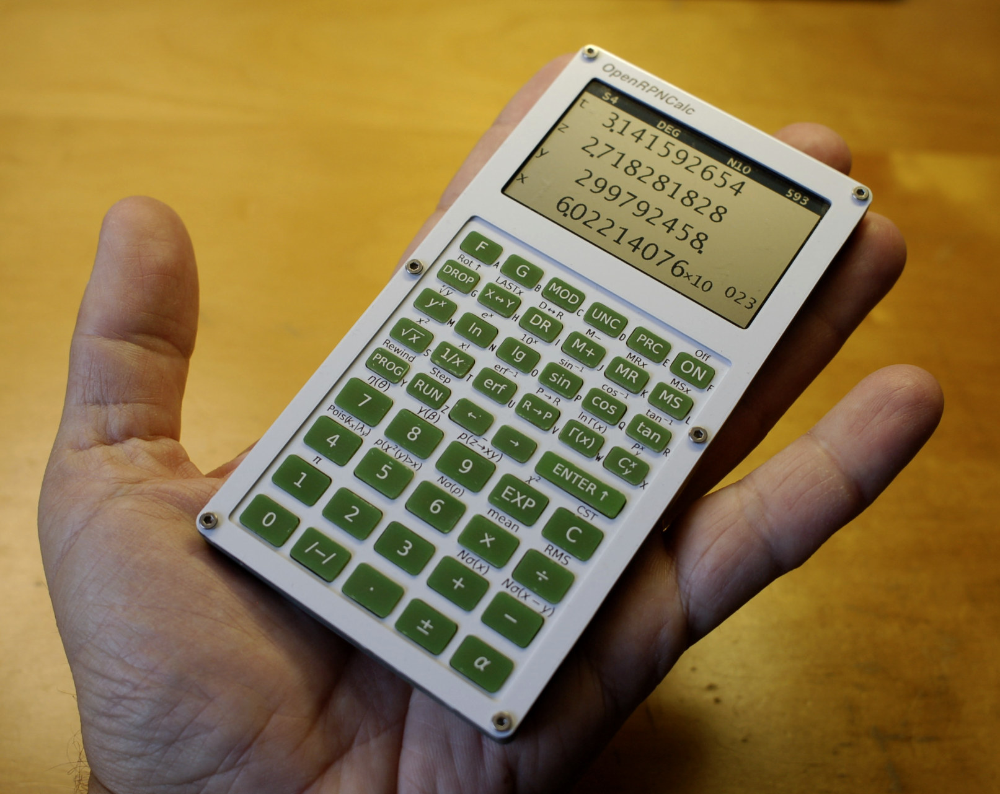

# Assembly

PCBs as they come from the prototyping service. The white ones are aluminium-based (black silkscreen on white mask), and the others are the usual FR4 (white silkscreen on black mask or green mask in the case of keycaps). 
The Alu PCBs are used as they are, while the FR4 PCBs contain panelised keycaps (the green board), parts of the jig to help solder the keys (denoted A, B, and C) and battery slot layers (3rd PCB in the top row) that have to be separated from the frames before assembling the enclosure. 

The soldering jig assembled. It's made as a stack of three 1.6mm-thick boards (denoted from bottom to top A, B, and C) kept together with M3 screws and nuts. The two slots on the edge are used to hold the top parts of the keycaps while finishing them with the file to remove "mouse bites" traces, while the two slots on the top side are used to precisely position the top and the bottom parts of the keycap while soldering them together. 

Soldered keycaps after cleaning with isopropanol. 

The main PCB (without soldering the electronic components) with Spacer 1 on top, battery holder and slot with the CR2032 battery, Enter key with its stabiliser and a couple of other keys. 

The main PCB with components soldered and Spacer 1 placed on top. The spacer has "rails" to precisely position the button switches for manual soldering. 

Closeup view of the (from left to right) USB-C connector, Reset switch, power switch and ST-LINK connector. 

Fully assembled calculator 

