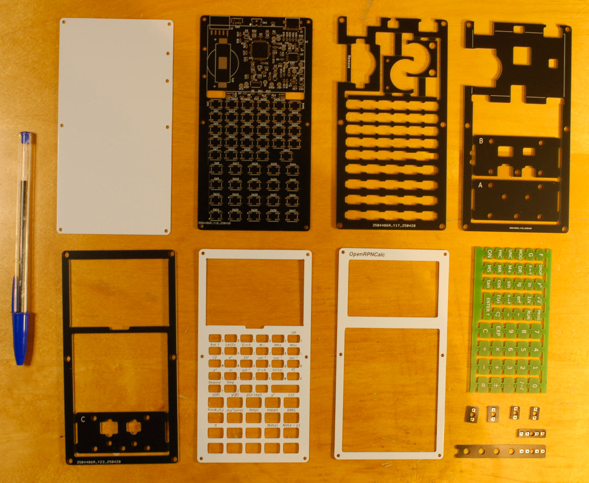

# Assembly

PCBs as they come from the prototyping service. The top three PCBs are aluminium-based (black silkscreen on white mask), and the bottom ones are the usual FR4 (white silkscreen on black mask). The Alu PCBs are used as they are, while the FR4 PCBs contain panelised key pads (the left- and rightmost boards) and parts of the jig to help solder the keys (two center boards) that have to be separated from the frames before assembling the enclosure. 

The soldering jig assembled. It's made as a stack of four 0.8mm-thick boards (denoted from bottom to top "A" through "D") kept together by M3 screws and nuts. The two slots on the edge are used to hold the top parts of the keycaps while finishing them with the file to remove "mouse bites" traces, while the two slots on the top side are used to precisely position the top and the bottom parts of the keycap while soldering them together. 

Soldered keycaps. These use additional 3D-printed spacers, which are clipped into the hole in the bottom keycap parts. The next version will use a different version of the Panasonic switch with a longer stem, such that the spacers will not be needed. 

Two parts of the enclosure: main PCB with the spacer, front panel, frame and keys (left) and keyboard PCB with two spacers (right). The keyboard PCB used in this version had a bug that required soldering a few wires visible in this photo; the files in this repository have this bug corrected. 

Same, with flex cable connecting the two PCBs and ready to be closed. 

Closeup view of the ST-LINK connector, power switch and the stack of PCB layers

