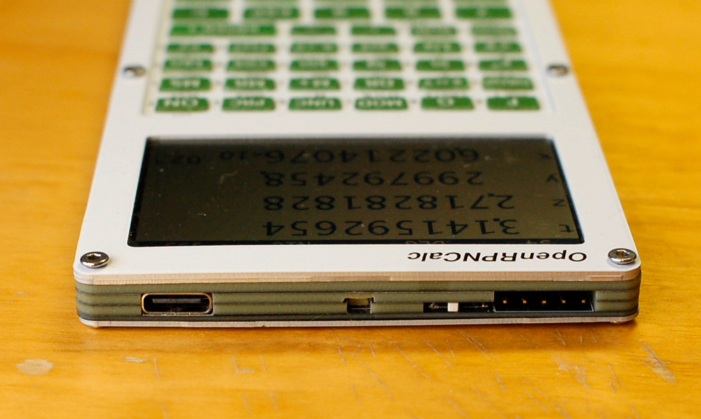

# Assembly

PCBs as they come from the prototyping service. 

Two parts of the enclosure: main PCB with the spacer, front panel, frame and keys (left) and keyboard PCB with two spacers (right). 

Same, with flex cable connecting the two PCBs and ready to be closed. The keyboard PCB used in this version had a bug which required soldering a few wires visible in this photo; the "rev3" repository has this bug corrected. 

Closeup view of the ST-LINK connector, power switch and the stack of PCB layers

