# PCB design

The enclosure is constructed as a stack of PCBs without needing 3D-printed elements.

Aluminium back panel and main PCB. All the PCBs are held together by six 4mm-high M2 brass standoffs. 

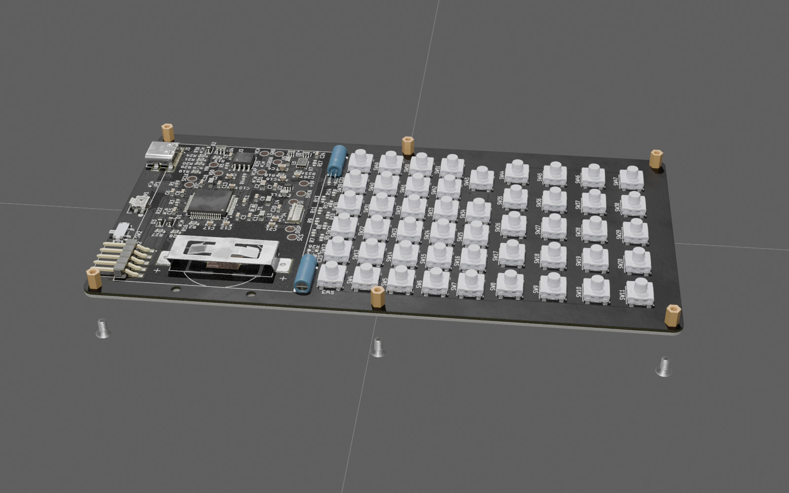

1st 1.6mm-thick spacer added. The standoffs need to be small enough to fit into 3.4mm holes in the spacers. The first spacer has guides to precisely position the keyboard switches while soldering. 

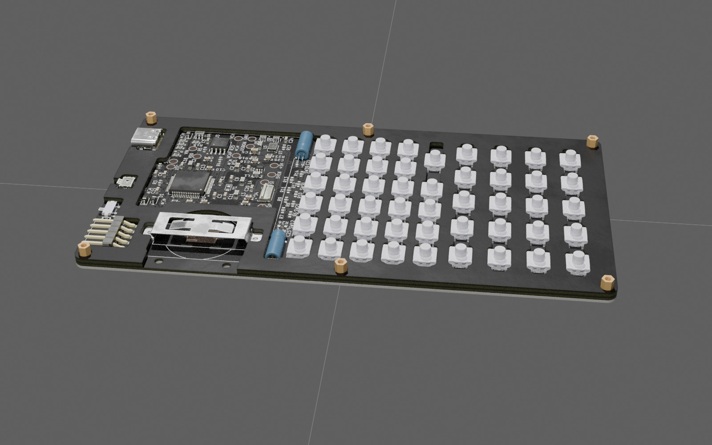

After adding the 2nd 1.6mm spacer. It covers most of the components on the main PCB and serves as a support for the LCD. 

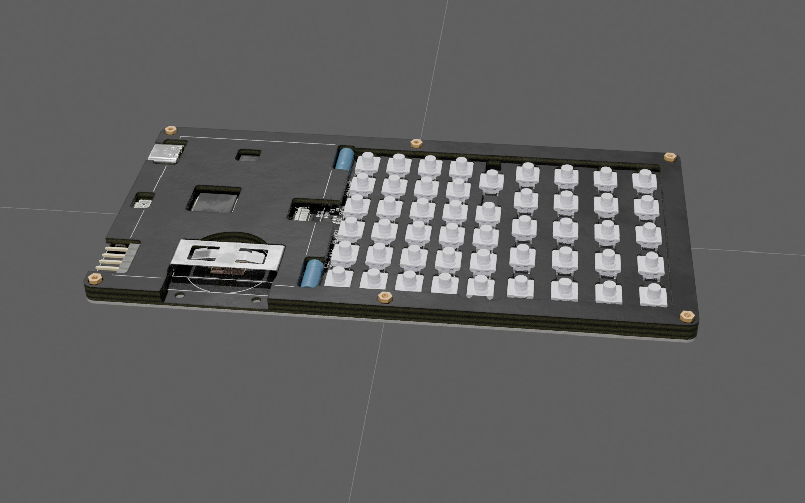

The battery slot is made of two 1.6mm PCBs held by two M2 screws and nuts. 

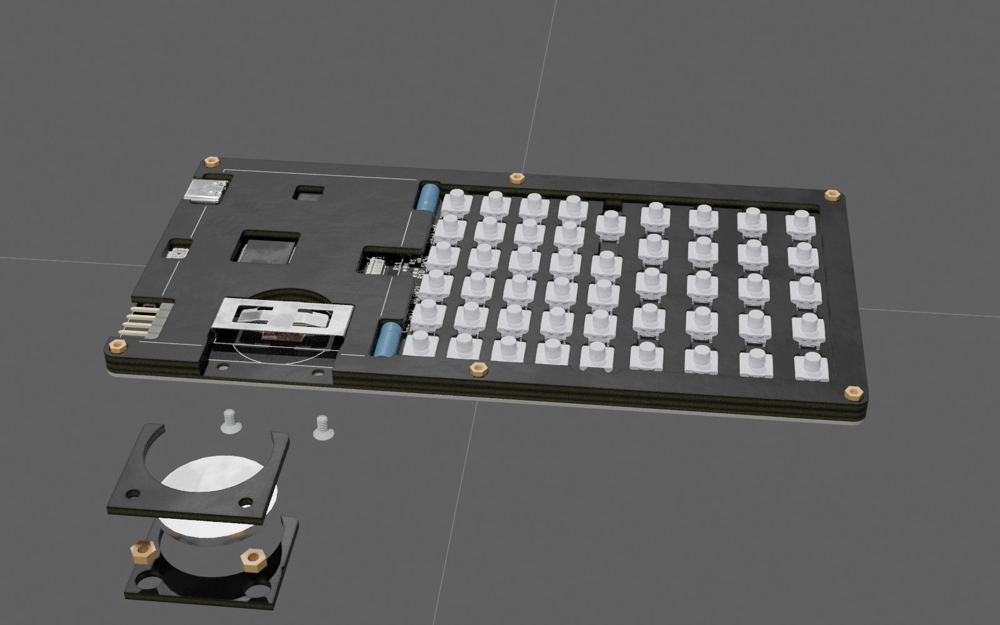

Battery slot installed in place. 

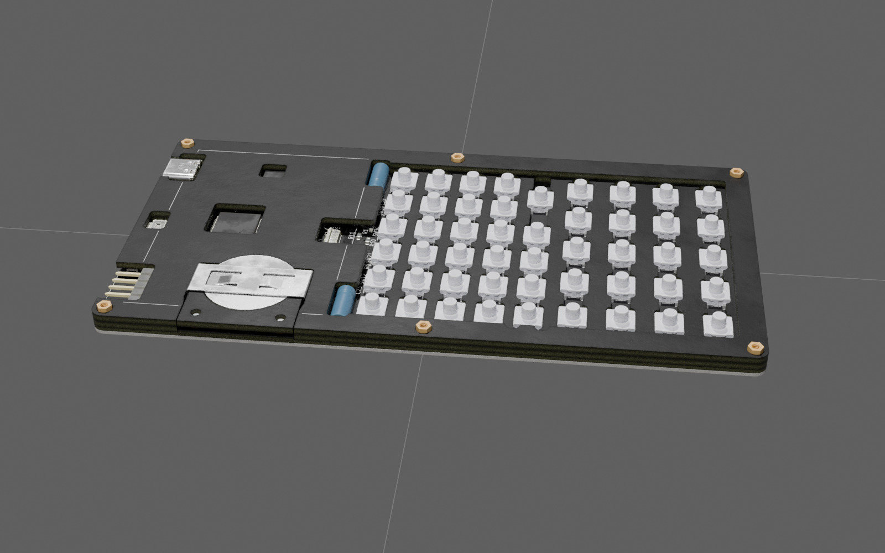

LCD connected. One needs to place an elastic (rubber) sheet of ~0.3mm thickness under the LCD such that it lies flat with the safe gap over the battery holder bracket. 

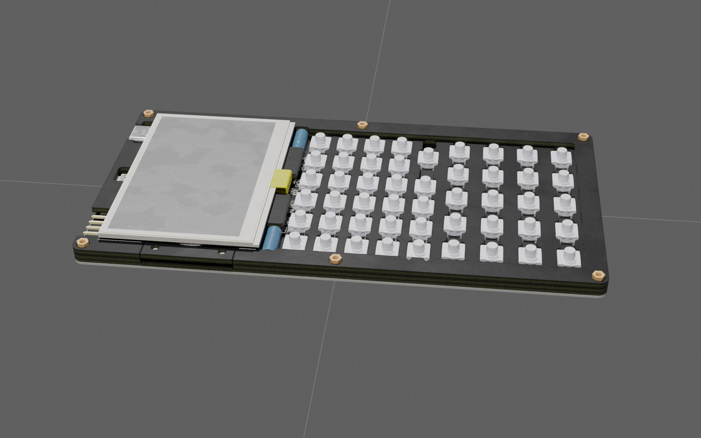

The 3rd 1.6mm spacer positions the LCD. 

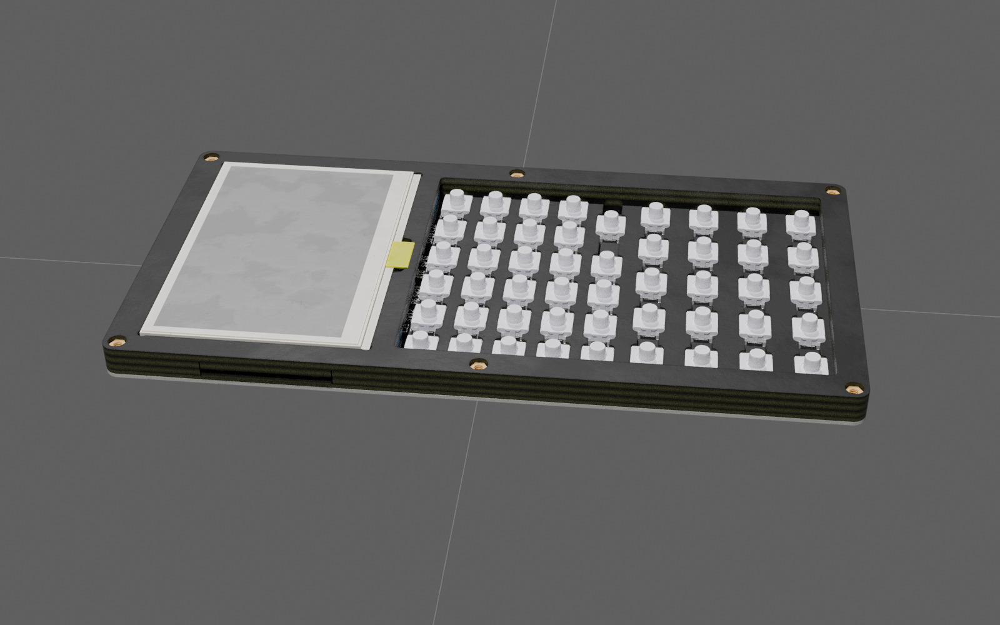

Keys are made of two parts soldered together: 1.6mm-thick top part with labels (with the solder pad on the bottom) and 0.8mm-thick bottom pad with plated through holes for soldering and 3mm diameter centre hole to put it tightly on the stem of the button switch. The wide "Enter" key has a thicker 1.2mm pad and a stabiliser that is hinged on the opposite side of the enclosure. 

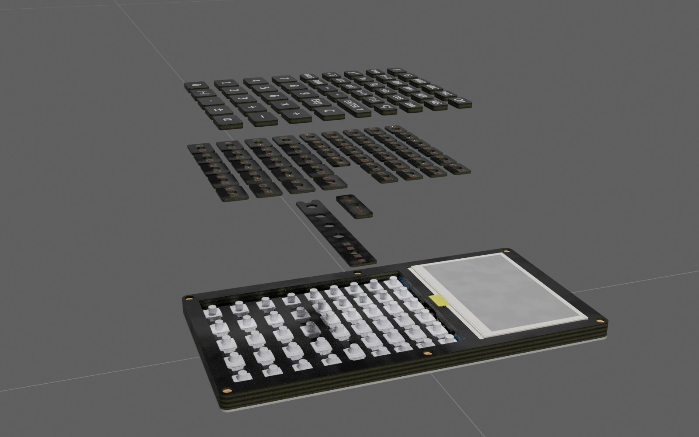

Wide "Enter" stabiliser and bottom pad put in place (in reality, it will also have the top part soldered at this stage). 

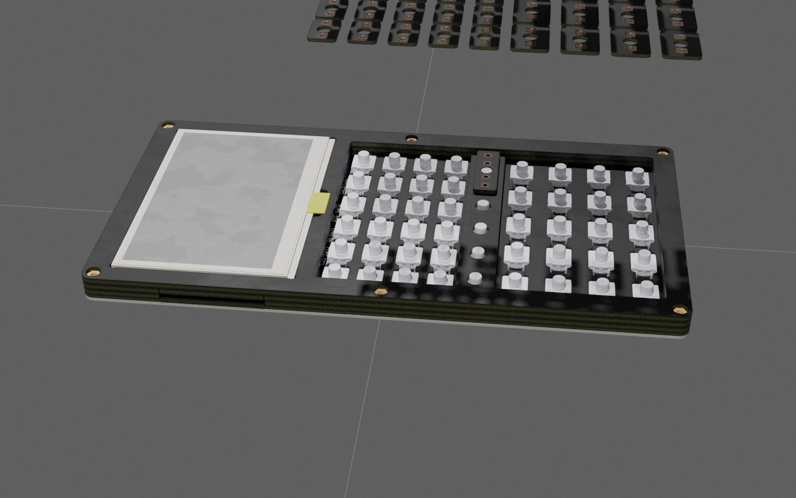

All keys put in place. 

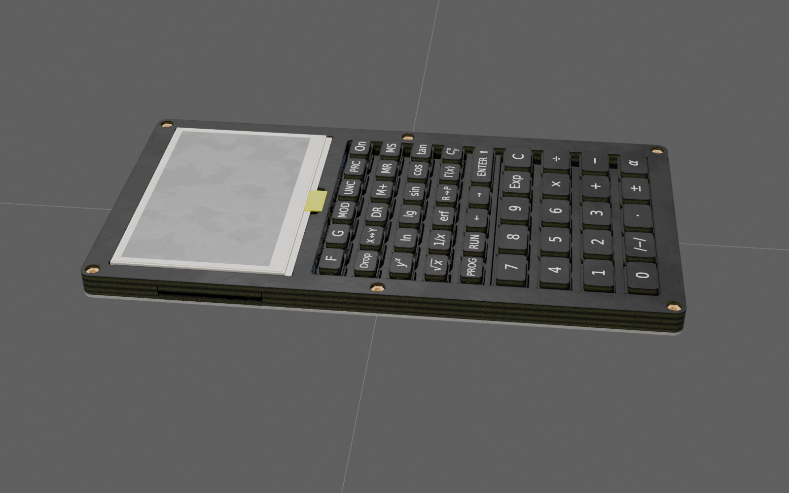

The front panel with labels and the frame that holds the LCD are held by six screws. 

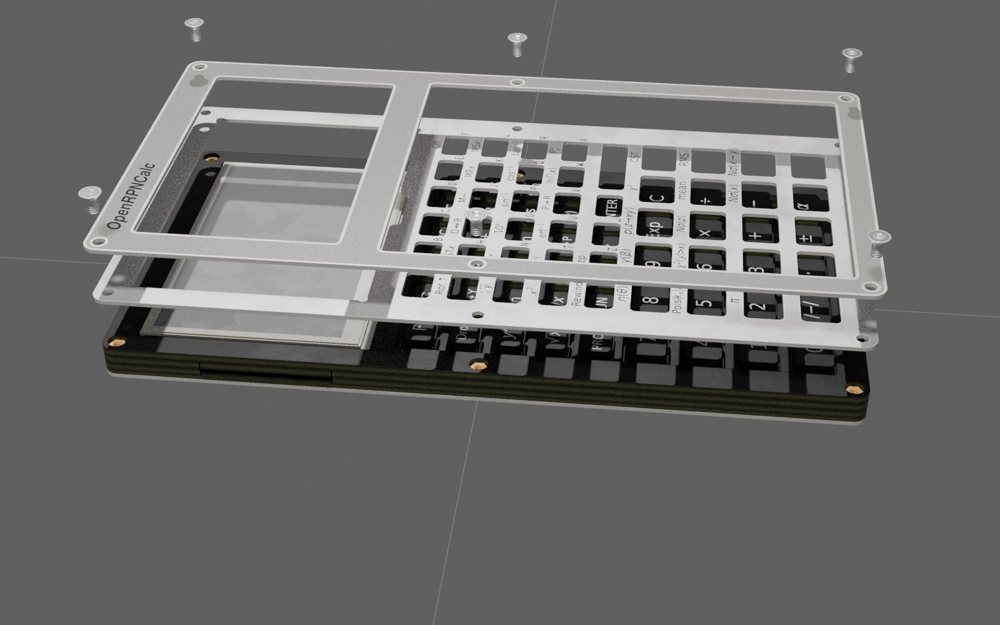

The calculator fully assembled. 

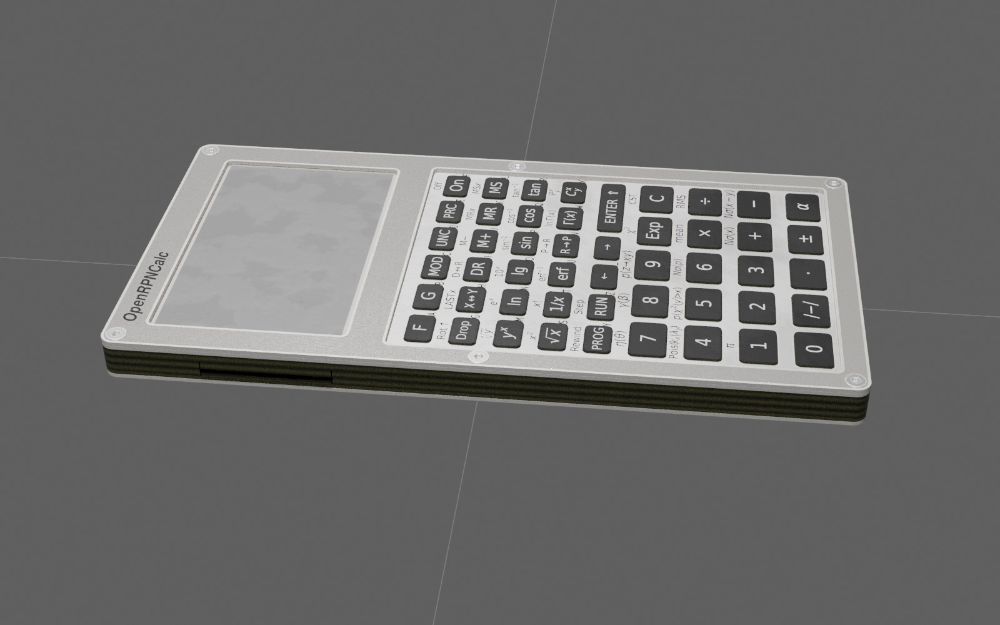
