# PCB design

The enclosure is constructed as a stack of seven PCBs held together by six brass standoffs and twelve M2 flat-head screws. The PCBs, from bottom to top, are: 

## Keyboard PCB

This 0.8mm-thick aluminium PCB houses the keyboard switches, a CR2016 battery cell holder, and a flex cable connector. It also serves as the back cover for the enclosure. 

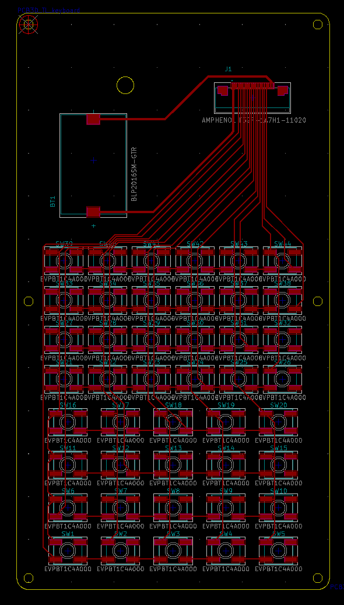 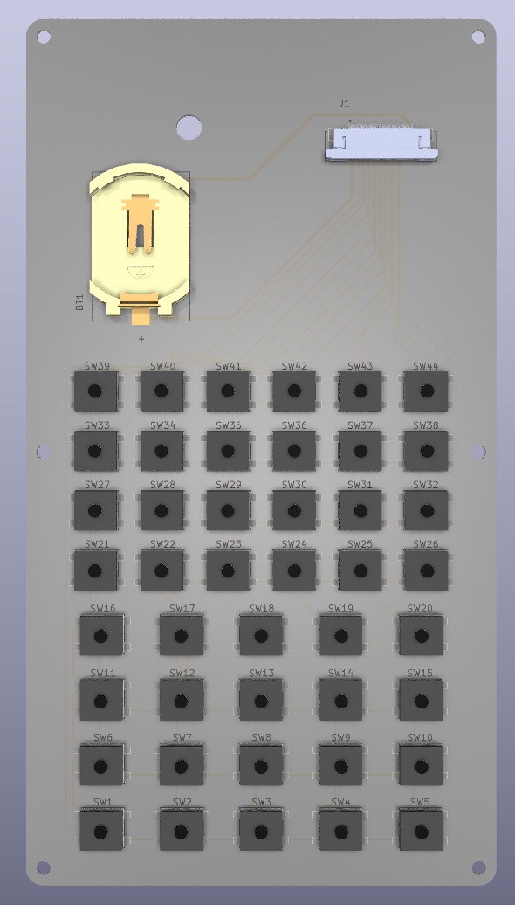

## Spacer 1

A 1.6mm-thick FR4 PCB that acts as a structural frame for the enclosure and includes panelised keycaps, which are separated during assembly. 

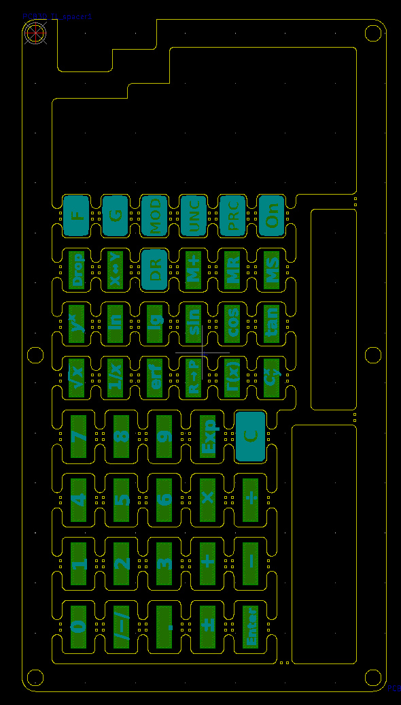 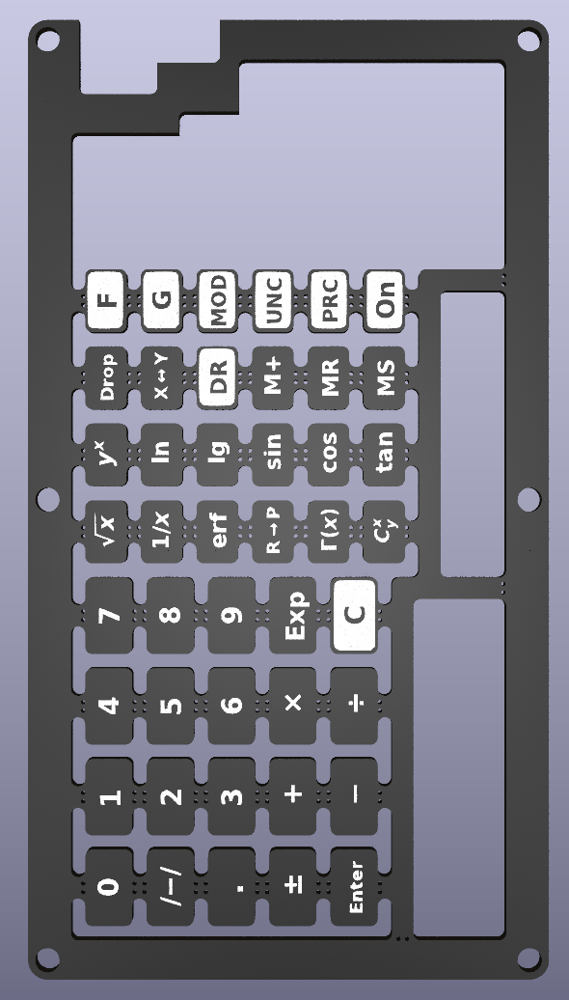

## Spacer 2

A 0.8mm-thick FR4 PCB that serves as both an enclosure frame and a layer of panelised key pads. 

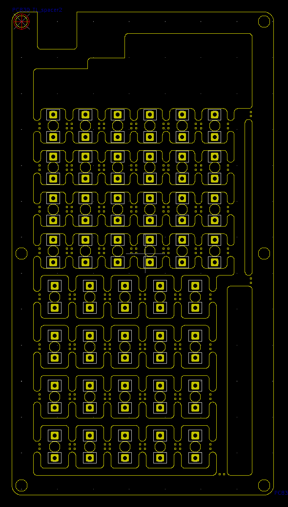 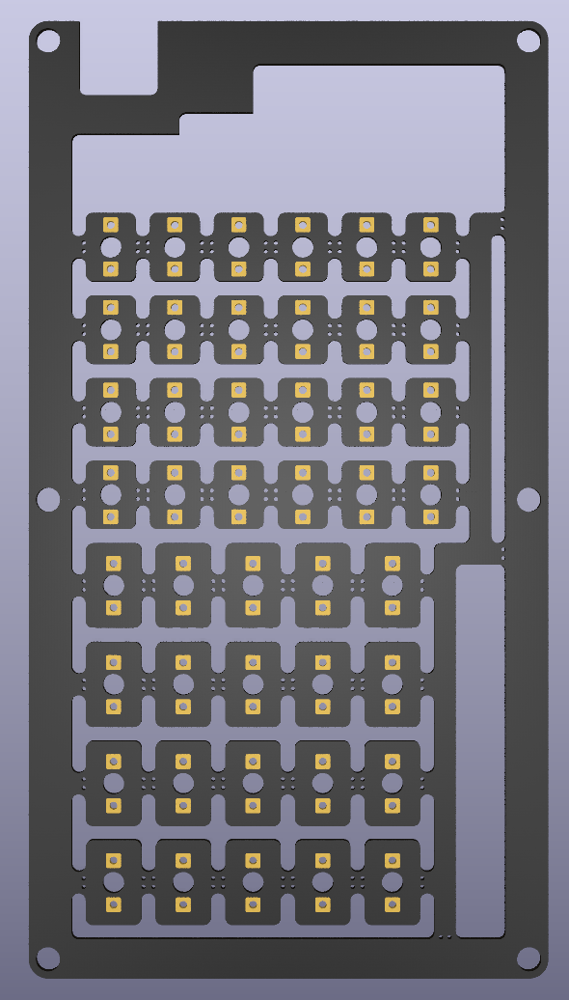

## MCU PCB

The main PCB (0.8mm-thick FR4) contains most of the electronics. The two separate panels ("B" and "C") at the bottom are parts of the jig used for soldering the keycaps. 

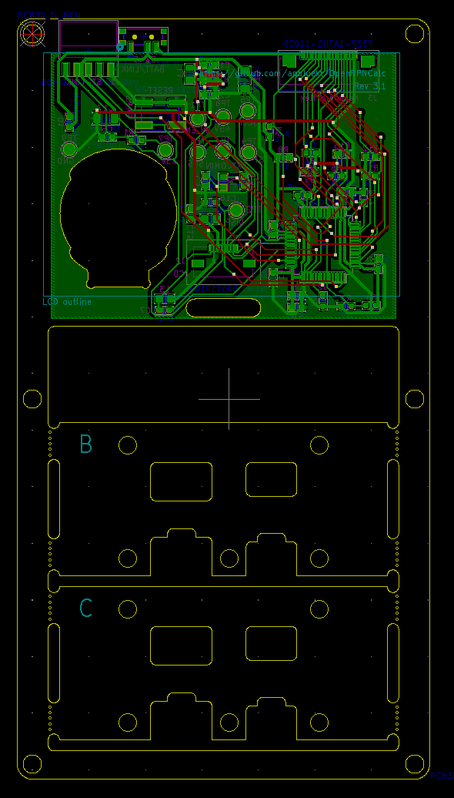 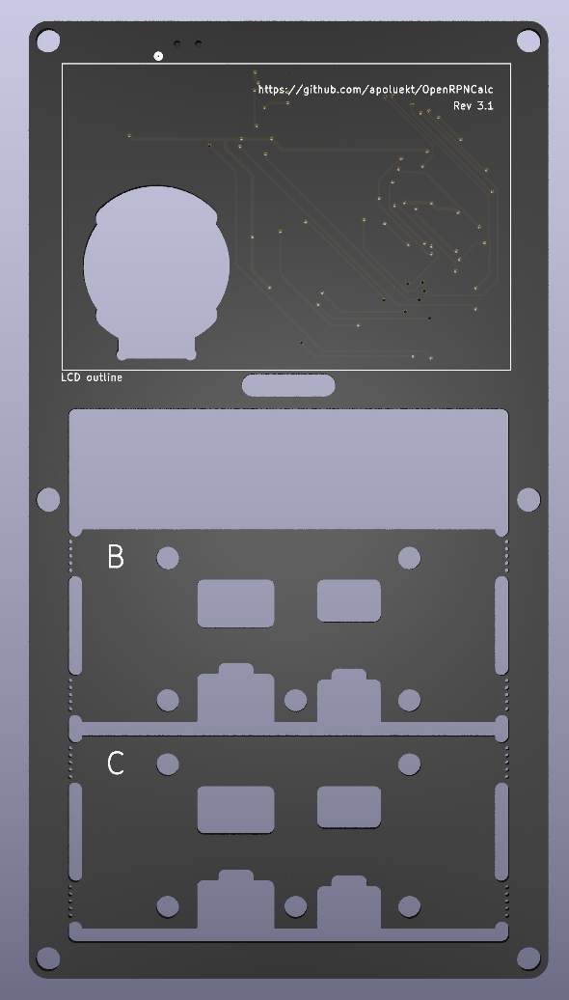 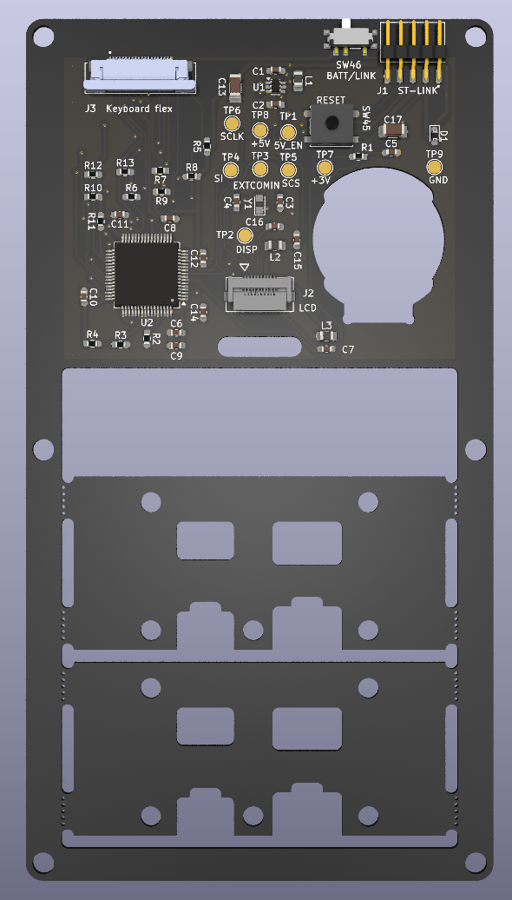

## Spacer 3

A 1.4mm-thick FR4 PCB that acts as a spacer between the main PCB and the front panel. The "A" and "D" panels are additional parts of the keycap soldering jig.

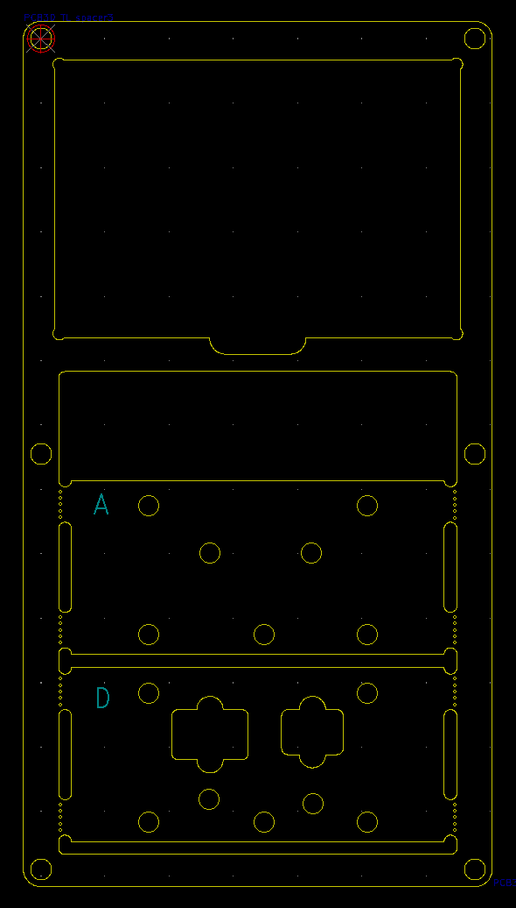 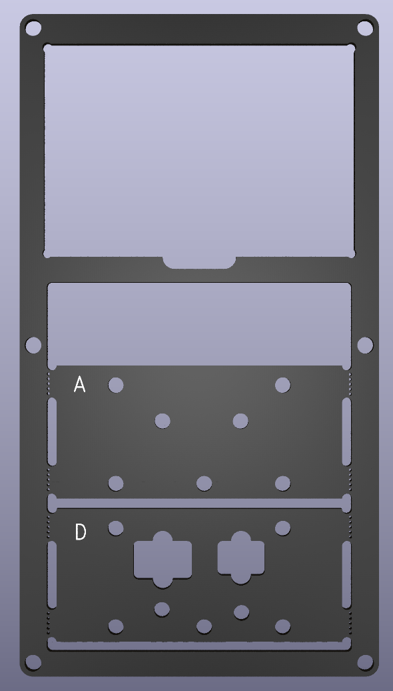

## Front panel

A 0.8mm-thick aluminium PCB. 

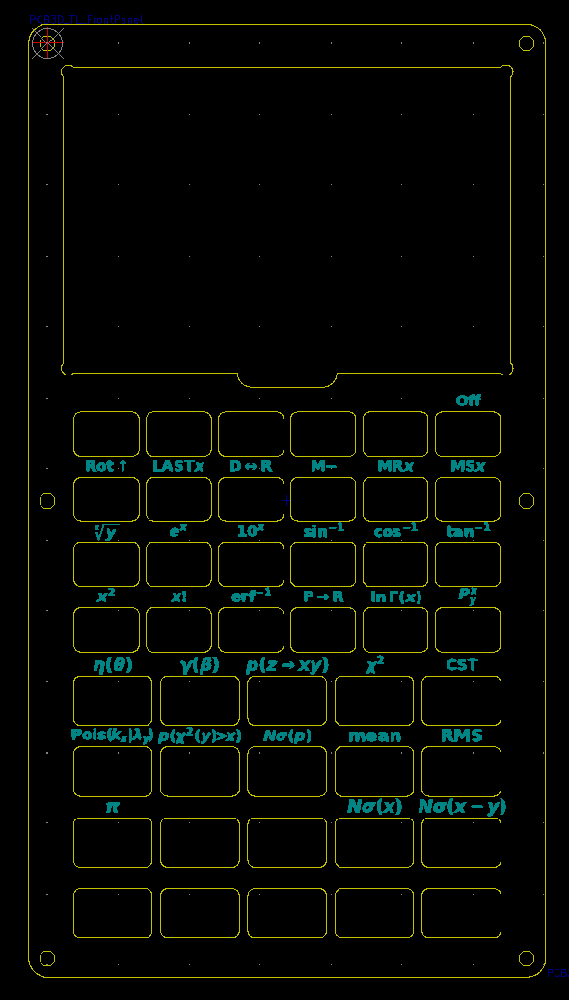 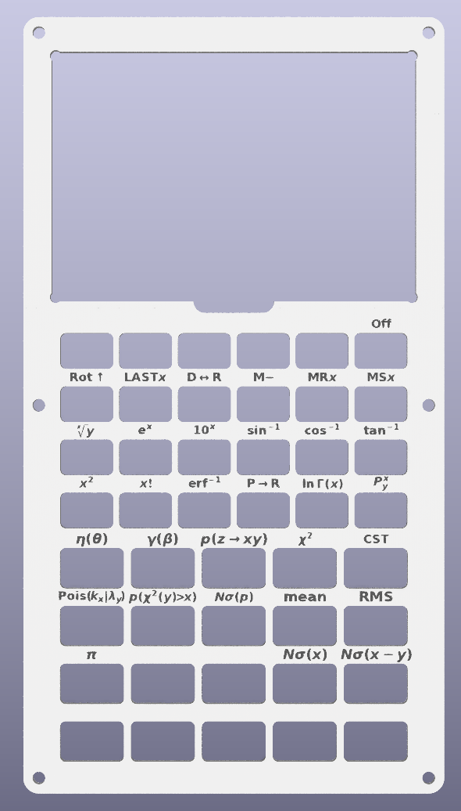

## Frame

A 0.8mm-thick aluminium PCB that holds the LCD and surrounds the keyboard to prevent accidental key presses.

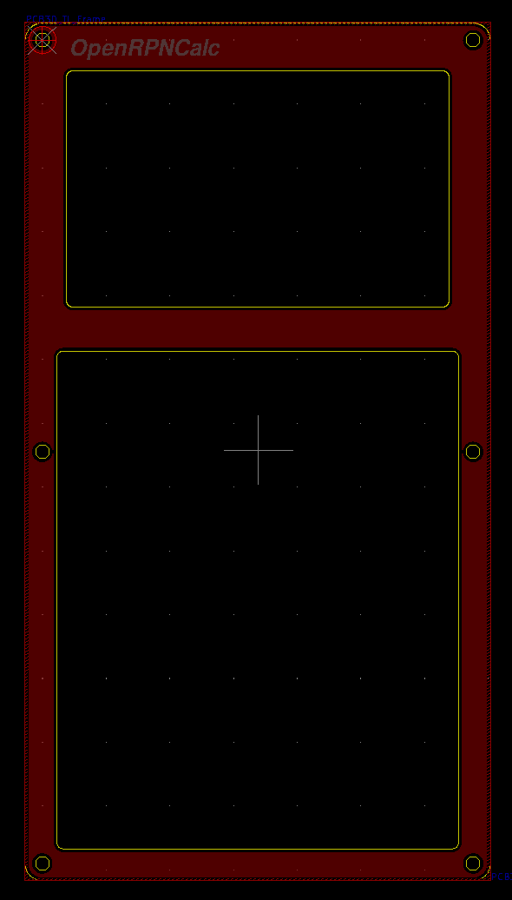 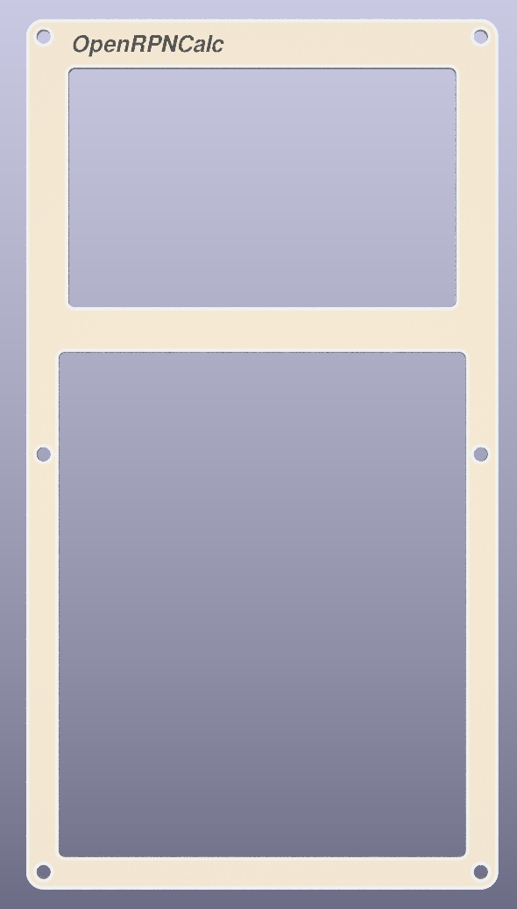

