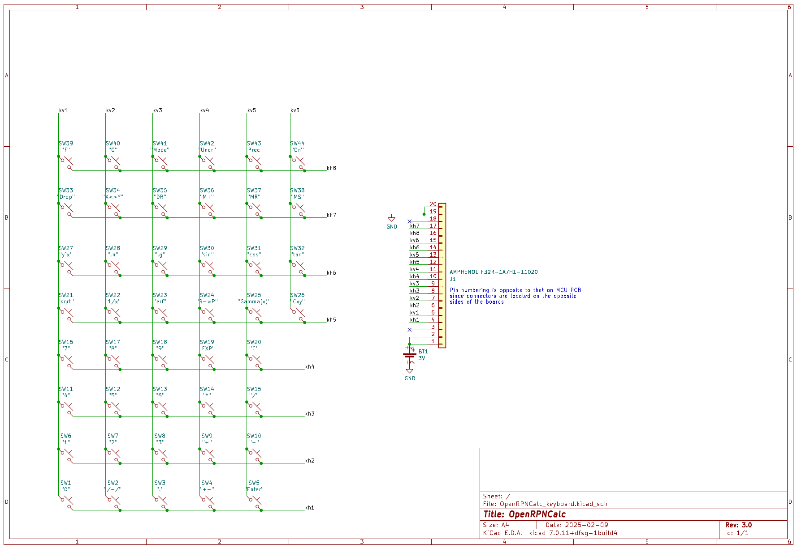

# Schematics

The main PCB with the STM32 chip, all auxiliary circuitry (such as 3V to 5V booster) and LCD connector

The PCB with buttons and battery holder

The two PCBs are connected by a 20-wire flex cable 

## Parts and datasheets

   * 1x Microcontroller [STM32L476RGT](https://www.st.com/en/microcontrollers-microprocessors/stm32l476rg.html)
   * 1x LCD display [LS027B7DH01](https://www.sharpsde.com/products/displays/model/LS027B7DH01/)
   * 1x Step-up 5V DC converter [TPS61222TCK](https://www.ti.com/product/TPS61222)
   * 44x Tactile switch Panasonic [EVPBT1C4A000](https://industry.panasonic.com/global/en/products/control/switch/light-touch/number/evpbt1c4a000)
   * 1x Molex connector (0.5mm pitch, 10 contacts) for LCD, such as Molex 5051101092
   * 1x Low-profile battery holder for 2016 coin cell [BLP2016SM-GTR](https://www.batteryholders.com/part.php?pn=BLP2016SM-GTR)
   * 2x Flex cable connectors (0.5 pitch, 20 contacts) for the connection between PCBs (such as Amphenol F32R-1A7H1-11020)
   * 1x 5-pin 2mm pitch SMD connector for ST-LINK probe (such as HARWIN M22-5330505)
   * 1x SMD slide switch (Nidec CUS-12TB) for battery/ST-LINK power switching
   * 3x SMD capacitors 10 uF, 0603 size
   * 7x SMD capacitors 100 nF, 0603 size
   * 2x SMD capacitors 100 uF, 1206 size
   * 2x SMD capacitors 1 uF, 0603 size
   * 1x SMD capacitor 560 pF, 0603 size
   * 2x SMD capacitor 47 pF, 0603 size
   * 1x SMD Schottky diode NSR0340HT1G, 0603 size
   * 3x SMD inductors 4.7 uH, 0805 size
   * 2x SMD resistors 10k, 0603 size
   * 9x SMD resistors 1M, 0603 size
   * 1x SMD crystal 32768 Hz, 2012 size (optional, not used in current firmware)
