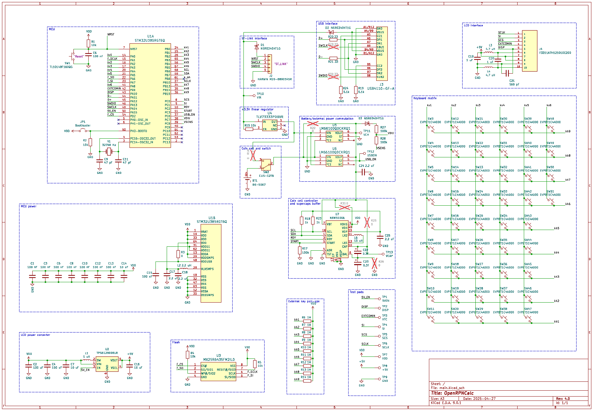

# Schematics and parts

Rev. 4 uses a single PCB for the MCU and keyboard

## Notes 

### MCU

* The most recent STM32U385 is used here (256kB RAM, 1MB flash, ultra-low power with only 10 uA/MHz consumption)
* JP1 must be shorted to enter the USB bootloader for the fresh (or bricked) chip. 

### MCU power

* MCU is powered by the internal SMPS supply to ensure maximum power efficiency. The relevant external elements are L2, C17, and C18.
* R3, C15 are needed only if the USB interface is used. Otherwise, VDDUSB can be pulled to ground (?)

### LCD power converter

* This circuit is needed to provide +5V for the LCD. The newer TPS61299 chip is used with only 95 nA quiescent current. The version with "true shutdown" mode is used here (i.e. +5V rail is grounded when 5V_EN signal is low). 

### Flash

* Low-power 8MB chip Macronix MX25R6435FM2IL0 in single SPI mode (faster quad SPI mode is not used). 

### LCD interface

* Standard circuitry from LS027b7DH01 datasheet.
* Note that since the LCD connector is positioned on the PCB side facing the LCD, and the flat cable is bent 180 degrees, we have to use the flat cable connector that has contacts on **top**. The part used here has contacts on both sides, but the most abundant connectors with only bottom contacts won't work! 

### USB interface

* USB-C connector in USB-2.0 mode.
* SBU1 and SBU2 contacts can optionally be connected to the ST-LINK interface lines by installing the bridges R29 and R30 (not populated by default). This should allow for using the [SWD over USB-C](https://hackaday.io/project/192857-swd-over-usb-type-c-new-way-of-programming-boards) programmer and debugger. 

### ST-LINK interface

* 2.5mm pitch connector. Can use either 5V or 3.3V (?) lines from the ST-LINK probe to power the calculator. 

### +3.3V linear regulator

* Simple LDO regulator that produces stabilised +3.3V from either USB or ST-LINK input.

### Coin cell and switch

* The power switch is installed to completely switch the power off without removing the battery. Normally, the MCU is always in the idle (STOP) mode waiting for the external interrupt, so operating the switch in normal operation is not needed. 

### Battery/external power commutation

* A pair of "ideal diodes" which take the power from the source with a higher voltage. The USB_ON signal tells the MCU that external power is connected.
* U5 and U6 are optional. Instead, one can install the bridges R22 and R16 to manually switch the power between the battery and external (USB/ST-LINK) sources. 
* D3, R27 and R28 make a switchable divider to measure the battery voltage when VSENS is pulled low. When VSENS is disconnected (most of the time), there is no current drain. One has to make sure that the MCU is operated at the voltage (VDD) not lower than the battery voltage, otherwise the current will flow via the internal protection diodes in the MCU. 

### Coin cell controller and supercaps buffer

* NBM5100A is the coin cell life booster with supercap buffer. It limits the maximal current drawn from the coin cell to a programmable value (can be as low as 2 mA), with the excess taken from the supercaps during periods of high power consumption. It also provides stabilised voltage to power the STM32 and other circuitry.
* NBM5100A is optional. Instead of installing it, together with the surrounding passive elements, one can install the brige R31 to directly connect the calculator circuit to the coin cell or external power. Possibly, one can also install one of the supercaps and add the bridge R26 (not two supercaps sequentially, due to the absence of balancing). Make sure the supercap can survive 3.3V input voltage in this case. 
* Output voltage for NBM5100A should be set to 3V to make sure that the switchable voltage divider (see above) works correctly. 

### External pull-ups

* 1M pull-ups are used instead of STM32 internal 40k pull-ups to limit the current draw when the keys are pressed.
* It seems that the input pin capacitance and parasitic capacitance of the keyboard traces are high enough that a quick scan of the keyboard matrix is impossible with such high-impedance pull-ups. Therefore, the firmware should use them only when waiting for an external interrupt in the idle mode (waiting for a key press event), but to do the keyboard scan to determine which key was pressed, one has to switch the internal pull-ups in addition. 

### Test pads

* LCD signals and voltages 

### Keyboard matrix

* No diodes are added, so only up to two simultaneous key presses can be registered without ghosting. 

## Parts and datasheets

