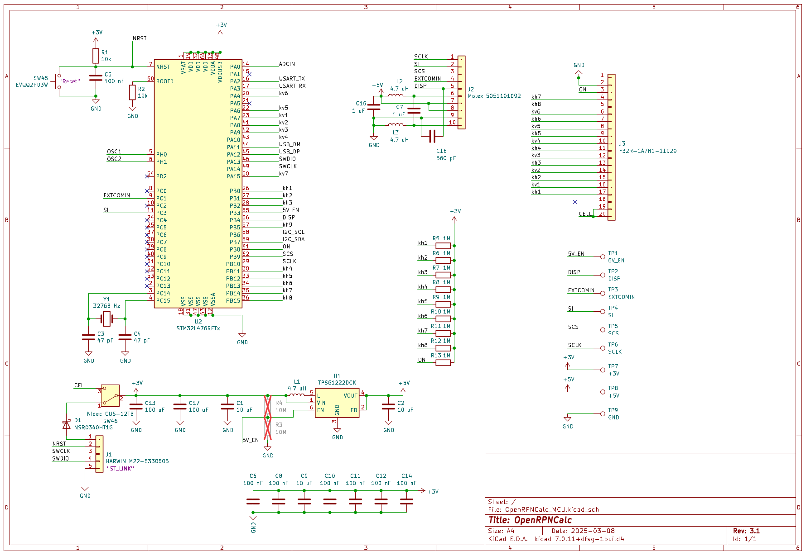

# OpenRPNCalc
Open-source and open-hardware scientific RPN calculator

## Introduction

OpenRPNCalc is a scientific calculator based on the STM32 microcontroller. Its source code, schematics, and PCB design files are released under an open license. The goal is to develop a hardware platform with the following features: 
  * Reproducible without special tools (ideally without requiring a 3D printer as well), using only boards produced by PCB prototyping services
  * A customizable keyboard to accommodate specific needs (such as RPN or algebraic logic, custom functions)
  * Low power consumption and long battery life
  * A high-quality, compact and sturdy enclosure

The hardware is inspired by the SwissMicros [DM42](https://www.swissmicros.com/product/dm42) calculator (which itself mimics the famous HP-42) but is designed from scratch. The calculator currently features: 

  * [Reverse Polish notation](https://www.hpmuseum.org/rpn.htm) with a large stack (up to 100 elements)
  * Double-precision arithmetic
  * "Standard" scientific calculator functions (trigonometric, logarithms, exponentiation, square root and power)
  * Error function (erf) and its inverse (erfinv), Gamma and log(Gamma) functions, combinations and permutations, p-values for Poisson, Gaussian, and chi-squared distributions
  * Fixed, scientific (SCI) and engineering (ENG) display modes (including SI prefixes in ENG mode), with adjustable precision from 3 to 10 digits
  * Calculations with uncertainties using error propagation (UNCERT mode) - a feature rarely found in software calculators and almost unheard of in hardware calculators
  * Formulas from relativistic kinematics (centre-of-mass two-body decay momentum, conversion between angle and pseudorapidity, beta and gamma factors)
  * 100 memory registers
  * Power consumption of ~16 uA in standby mode with the LCD on and 1-2 uA with the LCD off. 

## Hardware overview

The calculator is built around a low-power 32-bit ARM microcontroller, the [STM32L476](https://www.st.com/en/microcontrollers-microprocessors/stm32l476rg.html), running at 16 MHz. The display is a Sharp memory LCD module, the [LS027B7DH01](https://www.sharpsde.com/products/displays/model/LS027B7DH01/) (400x240 pixel monochrome). The keyboard uses light-touch tactile switches, specifically the Panasonic [EVQP0N02B](https://www3.panasonic.biz/ac/e/search_num/index.jsp?c=detail%E2%88%82no=EVQP0N02B) (60g actuation force). All electronics are powered by a 3V lithium battery (CR2016), which should be sufficient for several years of operation. 

The enclosure is designed as a stack of multiple PCBs. The front and back panels are aluminium PCBs with a white solder mask and black silkscreen. The keys are also made of PCB, with labels printed as silkscreen. All components are kept together with six M2 standoffs and twelve flat-head screws. The enclosure dimensions are 135 x 73 x 7 mm. 

## Repository contents

   * [Code](Code): STM32 firmware developed using STM32Cube IDE
   * [Hardware](Hardware): Schematic and PCB design files for KiCad, PCB production files
   * [Doc](Doc): Documentation and images 

## Documentation

   * [Schematics](Doc/schematics.md)
   * [MCU firmware](Code/README.md)
   * [PCB design](Doc/pcb_design.md)
   * [Case and keyboard assembly](Doc/case_design.md)

## Emulator 

[Online emulator](https://apoluekt.github.io/OpenRPNCalc/Emulator/), based on the original calculator firmware extended with Emscripten and Raylib
